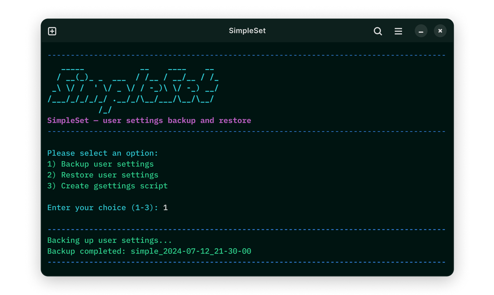

# SimpleSet Backup



This bash script is created for efficient backup of desktop environment
user settings. The core options rely on the `dconf` configuration tool,
but an advanced export involves converting a regular backup into a
shell-executable file with strings in `gsettings` format.

## Features

* Backup user settings  
  Export current desktop environment settings to the backup directory.  
  
* Restore user settings  
  Import desktop environment settings from a previously created backup.  
  
* Create gsettings script  
  Convert backup to shell-executable file (script) for advanced use.  
  

The default backup directory is `~/.config/simpleset`, except for the
advanced export where you are prompted to specify the path.

Automation is possible using `crontab` or `systemd.timer` with short
flags:

```
  -b        Silent backup to the default directory.
  -r        Silent restore of the last created backup.
  -c        Silent creation of a shell-executable file.
```

## Installation

```sh
git clone https://github.com/vmkspv/simpleset-backup.git
cd simpleset-backup
chmod +x SimpleSet
```

Run the script:

```sh
./SimpleSet
```

## Contributing

Contributions are welcome! Please fork the repository and submit a pull
request.

Feel free to customize the content as needed for your project.
